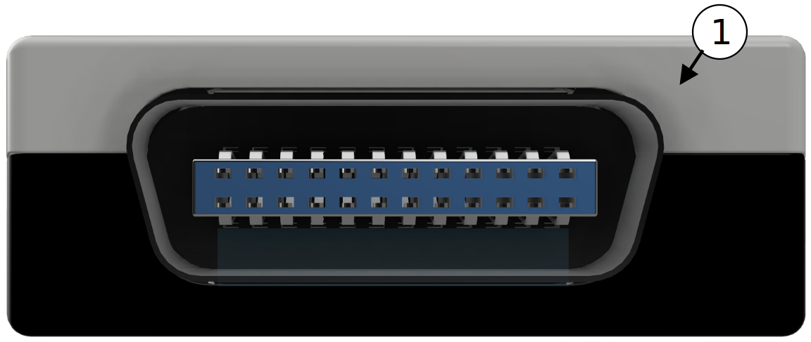
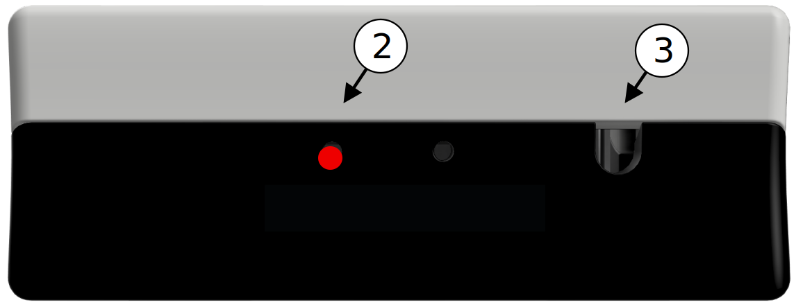
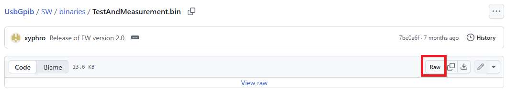
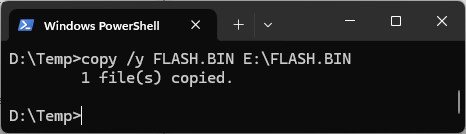

- [XyphroLabs UsbGpib V2 User
  Manual](#xyphrolabs-usbgpib-v2-user-manual)
- [Introduction](#introduction)
- [Advantages of UsbGpib V2 adapter](#advantages-of-usbgpib-v2-adapter)
- [Safety Precautions](#safety-precautions)
  - [Operating Conditions](#operating-conditions)
  - [Storage Conditions](#storage-conditions)
  - [Moisture & Contaminants](#moisture-contaminants)
  - [Electric Safety](#electric-safety)
  - [Handling & Installation](#handling-installation)
- [Overview](#overview)
- [LED](#led)
- [Using the adapter](#using-the-adapter)
- [Firmware update procedure](#firmware-update-procedure)
- [Technical specifications](#technical-specifications)
- [Frequently Asked Questions](#frequently-asked-questions)
- [References](#references)

# XyphroLabs UsbGpib V2 User Manual

**XyphroLabs UsbGpib V2**

Last Update: 1st February 2026

Prefer PDF? Click here:

# Introduction

The UsbGpib V2 is a compact, high-performance USB-to-GPIB adapter
engineered from the ground up for seamless integration with modern and
legacy test equipment.

Unlike clone devices, UsbGpib V2 delivers robust IEEE-488.1 and
IEEE-488.2 compatibility, stable USBTMC operation, and a unique device
identifier that ensures consistent VISA resource naming across systems -
eliminating the need for manual remapping or COM port assignments.

Designed to match the physical footprint and cable path of traditional
GPIB connectors, the adapter fits into all existing lab setups while
offering significant advantages in space efficiency, cable management,
and cross-platform support. Whether you’re automating instrument control
on Windows, macOS, Linux, or FreeBSD, UsbGpib V2 provides plug-and-play
reliability without proprietary drivers.

With firmware upgradability, protocol-aware communication, and a focus
on user-friendly integration, UsbGpib V2 is the ideal choice for
engineers, researchers, and developers seeking a dependable GPIB
interface that just works.

# Advantages of UsbGpib V2 adapter

- Modern Connectivity: Bridges USB and IEEE 488 (GPIB) with full USBTMC
  protocol compliance

- Slim Design: Minimal depth of just 1.5cm allows instruments to be
  placed closer to walls or rack panels

- Cable Efficiency: Uses thin USB cables instead of bulky "garden hose"
  GPIB cables, reducing clutter and improving portability

- Multi Adapter Support: Unique identifier per unit enables multiple
  adapters to be connected and operated reliably on the same PC

- No COM Ports: Avoids serial port mapping issues; Each adapter is
  consistently accessible with the same name across multiple PCs

- Transparent Operation: Plug into your instruments GPIB port and it
  behaves like a modern USB measurement device, including proper USB
  port deactivation when the instrument is powered off

- Controller Role: Optimized as a dedicated GPIB controller for one
  instrument per adapter, ensuring robust one to one communication and
  optimized cable management.

- Standards Compliance: Implements full IEEE-488.1 IEEE 488.2 controller
  support via USBTMC, including status byte reading, triggering, service
  requests, and termination settings

- Software Compatibility: Works seamlessly with all standard VISA
  providers (NI VISA, Rohde & Schwarz VISA, Keysight VISA)

- Tool Integration: Fully compatible with LabVIEW, MATLAB, PyVISA, and
  PyVISA py for established and modern automation workflows

- Cross Platform Support: Operation across Windows, macOS, FreeBSD, and
  Linux

- German Engineering: Designed and developed in Germany over six years,
  extensively tested for robustness and compatibility with instruments
  from new to decades old

- Reliability: Built to ensure long automated measurement sequences
  complete without interruption

- Future Proof: Firmware is field upgradable and actively maintained,
  providing ongoing improvements and compatibility updates

# Safety Precautions

To ensure reliable operation and long-term durability of the UsbGpib V2
adapter, please observe the following environmental and handling
Guidelines

## Operating Conditions

|                    |                               |
|:-------------------|:------------------------------|
| Temperature Range: | 0°C to +50°C                  |
| Humidity:          | 10% to 90% RH, non-condensing |
| Altitude:          | Up to 2000m above sea level   |

## Storage Conditions

|                    |                              |
|:-------------------|:-----------------------------|
| Temperature Range: | -20°C to +70°C               |
| Humidity:          | 5% to 95% RH, non-condensing |

## Moisture & Contaminants

- Avoid exposure to liquids, vapors or corrosive substances

- Do not operate in environments with condensation, high dust levels or
  chemical fumes

## Electric Safety

- Do not expose to voltage levels above 6V

- Do not short circuit or connect to non IEEE488 / non-USB compliant
  ports

- Ensure proper grounding of connected instruments

## Handling & Installation

- Do not bend or stress the USB or GPIB connectors during installation

- Avoid excessive force when plugging/unplugging

- Avoid direct sunlight

- Keep away from electrostatic discharge (ESD) sources; use ESD-safe
  handling procedures

# Overview

<table>
<tbody>
<tr>
<td style="text-align: left;"> 
</td>
<td style="text-align: left;">(1) GPIB connector - Plugs directly into
your measurement equipments GPIB port.</td>
</tr>
<tr>
<td style="text-align: left;"> 
</td>
<td style="text-align: left;">(2) Status LED 
(3) Firmware update button</td>
</tr>
<tr>
<td style="text-align: left;"> 
</td>
<td style="text-align: left;">(4) USB-Type C connector - plug it with
either a USB Type C to USB type A or USB type C to type C cable into
your PC.</td>
</tr>
</tbody>
</table>

# LED

The LED has multiple purposes as summarized in the table below.

<table>
<tbody>
<tr>
<td style="text-align: left;"> 
</td>
<td style="text-align: left;">The Adapter is connected to a USB port,
but no GPIB device is found. Connect a GPIB measurement device to the
GPIB port and ensure that GPIB is enabled in the instrument.</td>
</tr>
<tr>
<td style="text-align: left;"> 
</td>
<td style="text-align: left;">The GPIB device was identified, but no
GPIB communication is executed from PC.</td>
</tr>
<tr>
<td style="text-align: left;"> 
</td>
<td style="text-align: left;">Every time GPIB data is transferred from
the PC or to the PC, the LED will be turned off for short periods of
time. This indicates data exchange = activity.</td>
</tr>
<tr>
<td style="text-align: left;"> 
</td>
<td style="text-align: left;">The USB port is not connected to the PC,
the PC powered off or the USB cable defect.</td>
</tr>
</tbody>
</table>

# Using the adapter

To use the adapter, connect the USB-C connector with a USB cable to a
PC.

The GPIB connector can be plugged directly into the measurement
instrument, which you want to control. It can also connect via a GPIB
cable if required due to setup constraints.

When the measurement equipment is turned on and if the GPIB port is
enabled in the instrument, the adapter will enumerate on the PC as
USBTMC class device.

Operating system specific instructions & tutorials are available under
this link:

<https://github.com/xyphro/UsbGpib/blob/master/Tutorials/README.md>

Those tutorials explain how to ensure that a USB driver is installed and
guide through the first setup up to the point where you can talk with
the instrument.

Note: The UsbGpib Adapter does not enumerate on the PC, if it is not
connected to a GPIB measurement device, which is powered and GPIB
enabled.

# Firmware update procedure

The UsbGpib V2 adapter comes preinstalled with a firmware. But as the
firmware is actively maintained you might want to update the adapters
firmware sooner or later. The UsbGpib V2 adapter allows for firmware
updates. It requires the bootloader mode to be entered, followed by
programming the firmware and power cycling the adapter.

Firmware images are distributed via GitHub:

<https://github.com/xyphro/UsbGpib/tree/master/SW/binaries>

to download, left-click on "TestAndMeasurement.bin" file. After the new
page loads, click on the RAW button on the top right side:

After downloading the file, rename it to FLASH.BIN. Ensure to use
capital letters for the full filename during rename. Filenames with
lowercase letters like "Flash.bin", "flash.bin", "FLASH.bin" will result
in the firmware update procedure not to work (but it won’t break the
adapter).

After downloading the file, enter the bootloader:

- Connect the adapter to a PC via USB. The GPIB side can be left
  unconnected.

- Hold the button (3) down for a few seconds (use e.g. a pencil to push
  it), until the PC recognizes a memory stick device (USB flash or mass
  storage device).

A new drive appears on the PC:

Then open a command line and enter a command like the following:

Adjust the file paths and drive letters to your actual system. When no
error is shown, you can unplug USB (and GPIB) and reconnect to power
cycle the adapter and use the new firmware.

Note: Drag and drop operation e.g. from Windows explorer does will work.
Ensure you use the command line method as described.

# Technical specifications

<table>
<thead>
<tr>
<th style="text-align: left;"><strong>Item</strong></th>
<th style="text-align: left;"><strong>Specification</strong></th>
</tr>
</thead>
<tbody>
<tr>
<td style="text-align: left;">USB power requirements</td>
<td style="text-align: left;"><ul>
<li>
5V supply voltage nominal
</li>
<li>
Valid supply voltage range: 4.5V to 5.5V
</li>
<li>
100mA current consumption
</li>
</ul></td>
</tr>
<tr>
<td style="text-align: left;">USB standard</td>
<td style="text-align: left;"><ul>
<li>
USB 1.1, USB 2.0, USB 3 and higher are supported with full speed
mode
</li>
</ul></td>
</tr>
<tr>
<td style="text-align: left;"></td>
<td style="text-align: left;"></td>
</tr>
<tr>
<td style="text-align: left;">USB connector</td>
<td style="text-align: left;"><ul>
<li>
USB Type-C connector
</li>
<li>
Compatible with USB-A by using a USB Type C to USB Type A
cable
</li>
<li>
Compatible with USB Type C to USB Type C cable.
</li>
</ul></td>
</tr>
<tr>
<td style="text-align: left;">Supported IEEE-488 features</td>
<td style="text-align: left;"><ul>
<li>
IEEE-488.1, IEEE-488.2, HPIB, GPIB compatible
</li>
<li>
Service request (reported using interrupt transfers)
</li>
<li>
Device Clearing
</li>
<li>
Trigger
</li>
<li>
Status Byte read
</li>
<li>
GPIB write, read and queries 
(supports talker only, listener only and talker+listener
instruments)
</li>
<li>
Full timeout support for reliable operation
</li>
<li>
All GPIB features are exposed using the exact USBTMC equivalents
for good compatibility
</li>
</ul></td>
</tr>
<tr>
<td style="text-align: left;">Supported IEEE-488 device roles</td>
<td style="text-align: left;"><ul>
<li>
Controller
</li>
</ul></td>
</tr>
<tr>
<td style="text-align: left;">Operating Systems</td>
<td style="text-align: left;"><ul>
<li>
Windows
</li>
<li>
Linux, FreeBSD
</li>
<li>
Mac-OS
</li>
</ul></td>
</tr>
<tr>
<td style="text-align: left;">Dimensions</td>
<td style="text-align: left;"><ul>
<li>
Excluding GPIB connector: 
  60mm x 23mm x 15mm (Width x Height x Depth)
</li>
<li>
Including GPIB connector: 
  60mm x 23mm x 22mm (Width x Height x Depth)
</li>
</ul></td>
</tr>
<tr>
<td style="text-align: left;">Weight</td>
<td style="text-align: left;"><ul>
<li>
 30g
</li>
</ul></td>
</tr>
</tbody>
</table>

# Frequently Asked Questions

**Why doesn’t the adapter show up on my PC when I plug it in?**  
This is a feature called "Ghost Mode." The adapter only enumerates
(becomes visible) on the PC if it is connected to a GPIB instrument that
is powered on. This reduces device manager clutter when you have
multiple adapters connected to instruments that are currently off.

The reason for this feature is to make an instrument behave like one
with native USB interface and avoid seeing adapters on the PC with that
you can’t communicate anyway as there is no measurement equipment
connected.

------------------------------------------------------------------------

**What is the AutoID feature of UsbGpib V2?**  
AutoID is a feature where the adapter automatically queries the
instrument for its identity (using \*IDN?) and uses that information to
create a unique VISA resource name. For very old instruments that do not
support \*IDN?, this feature should be disabled to avoid errors. When
Auto ID is off, the Visa ressource name is constructed out of the GPIB
address of the instrument and a unique serial number of the GPIB
adapter.

------------------------------------------------------------------------

**What are the AutoID timing options?**  
When the autoID feature is enabled there are different delay options.
This delay specifies how long the adapter waits after instrument turnon
before executing the \*IDN? query for the autoID feature. While 5s works
for each instrument, some instruments require a setting to higher number
which is exposed by the other AutoID settings. AutoID is a non-volatile
setting which is permanently stored in the MCUs eeprom. **UsbGpibGui**:

- **AutoID ON:** The adapter waits 5 seconds after detecting a powered
  GPIB instrument before performing the identification scan `*IDN?`.

- **AutoID SLOW:** Increases the initial waiting period to 15 seconds
  before the scan begins.

- **AutoID SLOWEST:** Designed for instruments with very long boot
  sequences, this setting waits 30 seconds before attempting to
  communicate on the GPIB side.

- **AutoID OFF:** Disables the automatic identification query entirely.
  This is essential for older, non-SCPI instruments that do not support
  the `*IDN?` query and might return errors or lock up if they receive
  it.

**Tip:** Turn AutoID OFF for older non SCPI compliant instruments to
avoid that they start up with an Error. To change the AutOID settings
you can use e.g. the UsbGpibGui in the UsbGpib SW folder for Windows or
NiceGui for Linux. Note that UsbGpib GUI requires a Visa installation.

------------------------------------------------------------------------

**How do I set Read Termination?**  
It is best to use standard VISA attributes:

- Set `VI_ATTR_TERMCHAR_EN` to 1.

- Set `VI_ATTR_TERMCHAR` to `0x0A` (or any other ASCII character).

With firmware version \>= 2.2 you can set any read termination character
you like, from ASCII code 0 to 255. This enables instruments to react on
EOT, CR, LF or any other character like e.g. ’,’ for easier parsing of
input data. Independent of the set termination character setting the
instrument will always react on the GPIB EOI as termination of a read
query.

When read termination is turned off, the read termination is EOI only.

------------------------------------------------------------------------

**Is the UsbGpib adapter a clone of an existing commercial adapter?**  
No. This is a common and important misconception. The UsbGpib adapter is
a completely original, open-source hardware and software project and
does not copy commercial adapters. It works for that reasons without
risk of getting blocked or locked out in future.

- **Unique Identity:** Unlike the many inexpensive adapters found on
  online marketplaces, this is **not** a counterfeit clone of National
  Instruments (NI), Keysight or other hardware.

- **Safe to Use:** Because it is not a clone, it is safe from "driver
  sabotage." Vendor software updates (like those from NI-VISA) often
  detect and disable counterfeit hardware; since this adapter uses its
  own independent firmware and identity, it remains fully functional and
  stable regardless of official driver updates.

- **Standard Compliance:** Instead of mimicking a proprietary device, it
  implements the standard **USBTMC-USB488.2** protocol. This allows it
  to "nicely integrate" into any VISA environment by following industry
  standards rather than exploiting a specific manufacturer’s driver.

In short: It is a legally independent, professional-grade tool designed
to coexist peacefully within the ecosystem of your choice.

------------------------------------------------------------------------

**Does it support Service Requests (SRQ)?**  
Yes, the adapter actively pushes SRQ signaling to the PC via an
interrupt pipe, as mandated by the USBTMC 488.2 standard. This means
your software does not need to poll for status continuously.

------------------------------------------------------------------------

**Can I use it with Linux?**  
Yes, it can be used either as a standard USBTMC device or through
Linux-GPIB for advanced features like controlling multiple instruments
with a single adapter.

------------------------------------------------------------------------

**Do I really need to use a VISA library?**  
Technically, no—but it is highly recommended. Because the adapter
follows the standard **USBTMC** protocol, it is natively recognized by
modern operating systems.

- **With VISA:** Libraries like *R&S VISA* or *NI-VISA* provide a
  unified API. This is the most stable path for tools like LabVIEW or
  standard `PyVISA`.

- **Linux native:** You can interact directly with the kernel driver via
  `/dev/usbtmcX`. For advanced users, *Linux-GPIB* also supports the
  adapter via a dedicated firmware variant.

- **python-usbtmc:** A great alternative if you want to avoid a VISA
  installation entirely. It is a bit more "hands-on" (manual
  configuration), but it supports the full command set of the adapter
  more reliably than PyVISA-py in many cases.

- **PyVISA-py:** A "VISA-free" Python backend. While popular, it
  currently has an incomplete USBTMC implementation (e.g., issues with
  version queries). Basic instrument communication works, but it may
  require workarounds for advanced features.

**Recommendation:** Use **R&S VISA** for a lightweight, professional
setup, or the **python-usbtmc** package if you strictly require a
driverless Python environment.

------------------------------------------------------------------------

**Can the CMU200 which uses GPIB subaddressing be used with this
adapter?**  
Yes, the CMU200 is supported and used too by me. USbGpib exposes the
first subaddresses which gives access to most features.

Also other devices with GPIB subaddressing are supported. UsbGpib will
always expose the firstly found subaddress over USBTMC.

------------------------------------------------------------------------

# References

<table>
<thead>
<tr>
<th colspan="2" style="text-align: center;"></th>
</tr>
</thead>
<tbody>
<tr>
<td style="text-align: left;">Issue reports and support</td>
<td style="text-align: left;"><a
href="https://github.com/xyphro/UsbGpib/issues">https://github.com/xyphro/UsbGpib/issues</a></td>
</tr>
<tr>
<td style="text-align: left;">Technical support and feature
requests</td>
<td style="text-align: left;"><a
href="mailto:xyphro@gmail.com">xyphro@gmail.com</a></td>
</tr>
<tr>
<td style="text-align: left;">Firmware download</td>
<td style="text-align: left;"><a
href="https://github.com/xyphro/UsbGpib/blob/master/SW/binaries/TestAndMeasurement.bin">https://github.com/xyphro/UsbGpib/blob/master/SW/binaries/TestAndMeasurement.bin</a></td>
</tr>
<tr>
<td style="text-align: left;">Tutorials</td>
<td style="text-align: left;"><a
href="https://github.com/xyphro/UsbGpib/blob/master/Tutorials/README.md">https://github.com/xyphro/UsbGpib/blob/master/Tutorials/README.md</a></td>
</tr>
</tbody>
</table>
