- [XyphroLabs UsbGpib V2 Windows + Visa
  Guide](#xyphrolabs-usbgpib-v2-windows-visa-guide)
- [Introduction](#introduction)
- [SW setup](#sw-setup)
  - [Installation of R&S Visa](#installation-of-rs-visa)
  - [Python setup](#python-setup)
- [HW Setup](#hw-setup)
- [First interaction with the
  instrument](#first-interaction-with-the-instrument)
  - [Confirming that the USB device is
    detected](#confirming-that-the-usb-device-is-detected)
  - [Testing if the instrument is detected by R&S
    Visa](#testing-if-the-instrument-is-detected-by-rs-visa)
- [Usage with Python](#usage-with-python)
  - [Scanning for connected devices](#scanning-for-connected-devices)
  - [Some more pyvisa Hints](#some-more-pyvisa-hints)
    - [Stripping of read termination](#stripping-of-read-termination)
    - [Automatic write Termination
      addition](#automatic-write-termination-addition)
    - [Timeout handling](#timeout-handling)

# XyphroLabs UsbGpib V2 Windows + Visa Guide

**XyphroLabs UsbGpib V2**

Last Update: 2nd February 2026 This document is part of [Xyphro
UsbGpib](https://github.com/xyphro/UsbGpib) project

Prefer PDF? Click here:

# Introduction

This document offers instructions for using the UsbGpib adapter with
Windows environments, particularly when integrating with Python.

Although the UsbGpib Adapter functions like other USBTMC instruments by
presenting a standard UsbTmc interface, these guidelines are primarily
aimed at assisting users who are new to instrument control, providing
them with an effective starting point for configuration and utilization.

On Windows platforms, there 2 popular methods for interfacing with
USBTMC instruments: One utilizes LibUsb in conjunction with PyVisa-Py,
while the other employs the conventional approach of using a VISA tool.
Given the complexities that can arise during LibUsb installation, it is
advisable to proceed with a standard VISA provider.

Leading VISA tools are offered by National Instruments, Key-sight, and
Tektronix. However, these solutions often require significant disk
space. In contrast, the R&S VISA package is notably compact - requiring
less than 100 MB - enabling swift installation without compromising on
performance or compatibility. Many alternative Visa tools include
superfluous components and may require over 1 GByte of storage space in
addition to extended download times.

This document details the process for installing R&S VISA and PyVisa,
guiding users through to the initial stages of communicating with an
instrument using Python.

# SW setup

## Installation of R&S Visa

Download R&S Visa from the R&S Page:
<https://www.rohde-schwarz.com/us/driver-pages/remote-control/3-visa-and-tools_231388.html?change_c=true>

In case that link does not work at time of reading, search the web with
"R&S Visa Windows download".

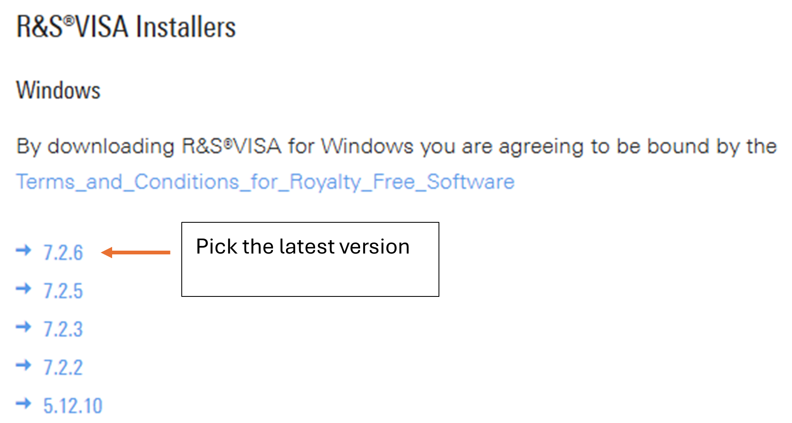

DoubleClick the downloaded file to start installation.

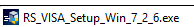

Please select the necessary components. For this guide, the primary
requirement is the R&S VISA for Developer 64/32-Bit. If you also plan to
use VISA with .NET applications in the future, it may be beneficial to
include that component as well. However, for Python-specific usage, this
selection is not required.

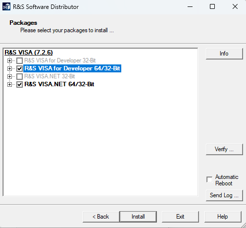

After selecting, click Install.

The R&S Visa installation also installs the USB driver for the UsbGpib
adapter.

## Python setup

For accessing R&S Visa using Python you need to install pyvisa.
Depending on your Python environment that can be done with Anaconda or
Pip. When you use pip, you can just type "`pip install pyvisa`" in a
command window. In case you have multiple python installations, ensure
you do that for the one that you also use later. When using Spyder as
python IDE, you can also type that command directly into the python
Console:

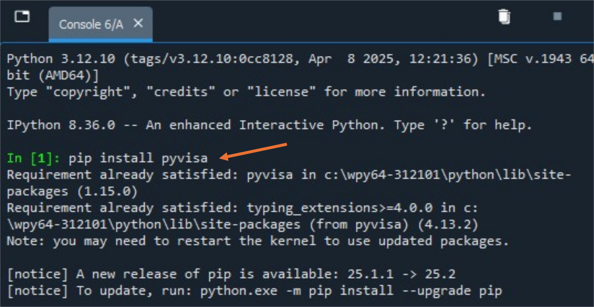

After the HW setup we will come back to python and some basic first
steps in using it.

# HW Setup

In this example I use a HP3457A Multimeter with GPIB:

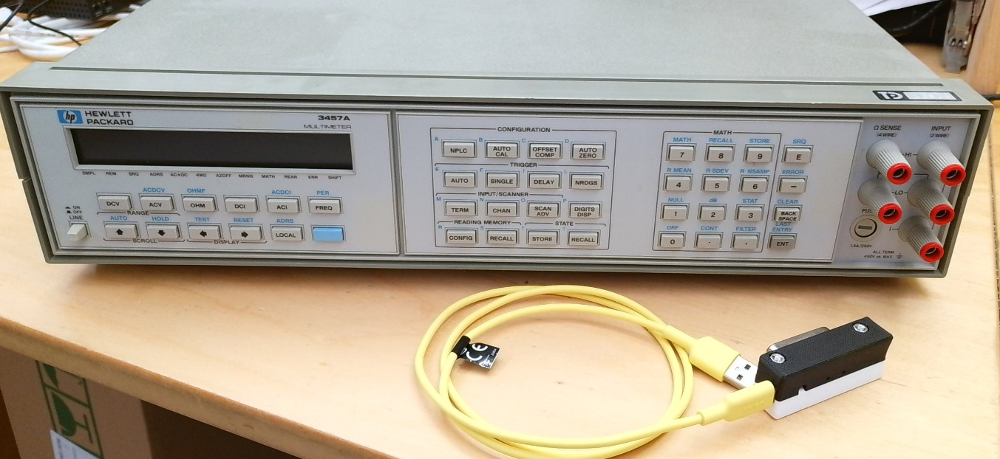

Initial one-time steps:

- Connect it to power but keep it powered off.

- Connect the USB GPIB converter to the GPIB port and the USB cable to
  your PC.  
  Note: The PC won’t detect a USB device yet as the instrument is
  powered off. This is a feature to prevent inaccessible devices are
  showing up on your PC.  
  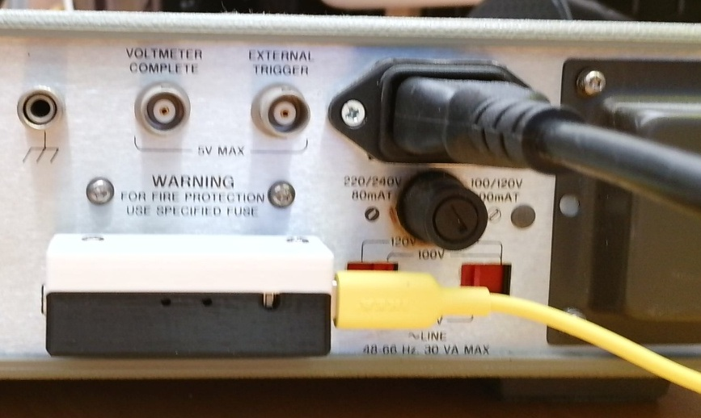

- Power on the GPIB device.  
  Note: The PC does now detect a new USB Device.

It is not necessary to follow a specific sequence for connecting or
disconnecting devices, powering them up or down, and similar actions.
However, the following order is provided to present the instructions in
a logical, step-by-step manner. As indicated in the procedure, the
adapter will only be detected by a PC when the instrument is powered on
and GPIB functionality is enabled. The adapter monitors USB connections
to identify whether any devices with GPIB enabled are present.
Regardless of the specific GPIB address, it systematically scans all
available addresses on its GPIB port. Upon detecting a responsive GPIB
address, the adapter enumerates the device on the USB interface, thereby
enabling access from the PC.

# First interaction with the instrument

## Confirming that the USB device is detected

You can check in the Device manager to confirm if the instrument was
found and the driver (which got installed by the R&S Visa installation)
is found.

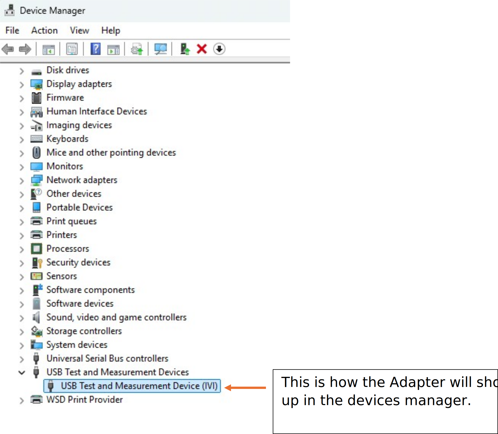

When double-clicking that item and selecting Details you can check if
this is the Adapter and also see the serial number:

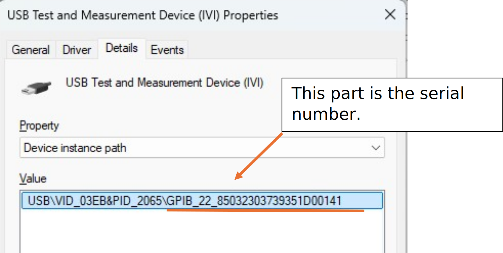

The serial number is different for each device. It is constructed out of
the detected GPIB address of the connected GPIB instrument (here
GPIB_22) followed by a unique ID which is different for each adapter.
That allows to use same GPIB addresses for multiple instruments, without
them disturbing each other.

## Testing if the instrument is detected by R&S Visa

Start the RsVisa Tester application:

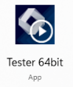

After starting the below GUI window is shown:

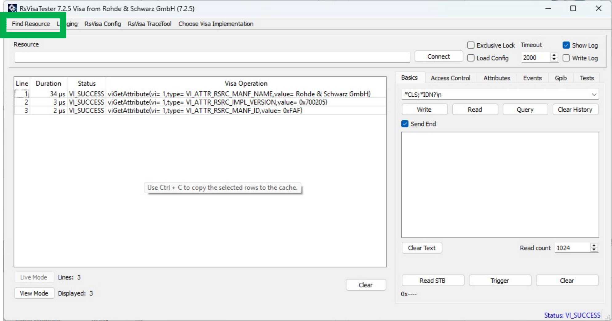

While the interface may appear complex to first-time users, it contains
numerous standard features that help in initial instrument communication
and debug. To verify detection of the GPIB instrument, select "Find
Resource" in the upper left corner.

A new window opens:

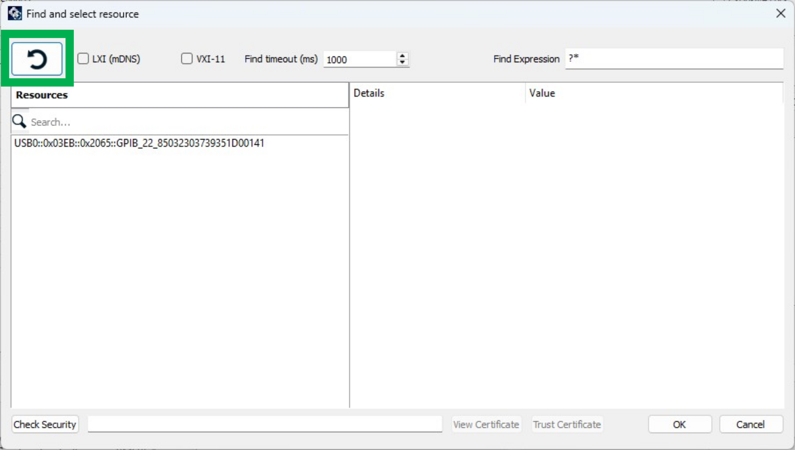

Select the green-highlighted button to initiate an instrument scan.

If the operation is successful, a USB device should be visible as shown.
Please note that the previously displayed serial number forms part of
the resource string.

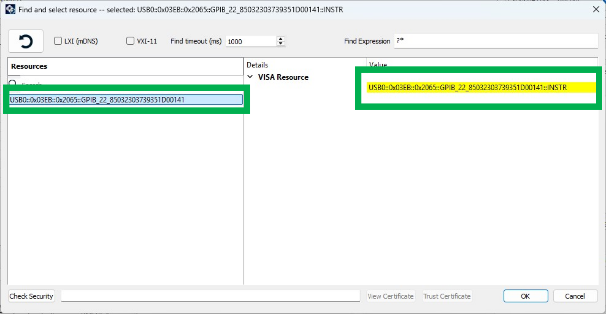

Select the found devices and click OK.

Now you are back to the main window. The resource field should show the
previously detected device:

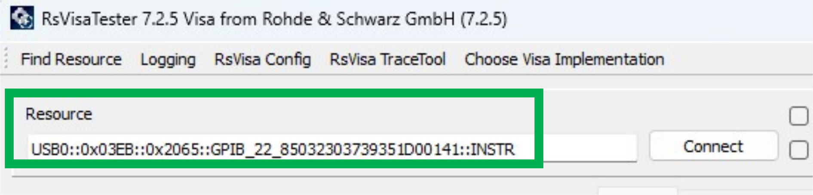

Now you can click on the connect button to connect to the instrument.
The log lines should show a successful connection:

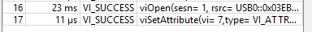

The right side of the main GUI window now gives the ability to interact
with the instrument:

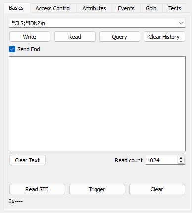

If your instrument supports the `*IDN?` query, you may enter "`*IDN?`"
in the designated field and click Query; the instrument’s response will
then be displayed. However, many legacy instruments do not support this
command and may also lack EOI termination during read operations, which
can lead to unsatisfactory timeout errors giving the impression that
communication is not possible

For this reason, I have prepared this manual for the older HP3457A,
which requires some additional configuration steps. These requirements
are not unique to this USB GPIB Adapter - they apply to any GPIB adapter
and are dictated by the instrument itself.

The equipment’s GPIB programming manuals offer detailed guidance on
configuring the appropriate settings, and additional support is
available in the troubleshooting section if necessary. For certain
legacy instruments, these settings may be challenging to locate and may
require some degree of experimentation.

<u>**Point \#1:**</u> The used HP3457A does default wise not terminate
with EOI, but with \n. A query will result in a timeout. To enable \n
termination, go to the Attributes tab, select `VI_ATTR_TERMCHAR_EN`,
enter 1 in New AttributeValue field and click on SetAttribute.

To enable \n termination, go to the Attributes tab, select
`VI_ATTR_TERMCHAR_EN`, enter 1 in New AttributeValue field and click on
SetAttribute.

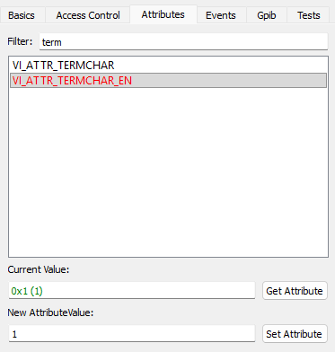

This is a non permanent setting, which is only valid for this currently
active session.

The attribute VI_ATTR_TERMCHAR does select the actual termination
character which is used to detect a termination of read GPIB messages.
Default wise it is 0xa (10), which matches \n and is for most older HP
instruments the correct settings.

<u>**Point \#2:**</u> HP3457A does not support the \*IDN? SCPI standard
query. Older HP Equipment required “ID?\r\n” as query.

After adjusting the termination settings as stated in Point \#1 you can
try to execute the ID?\r\n query:

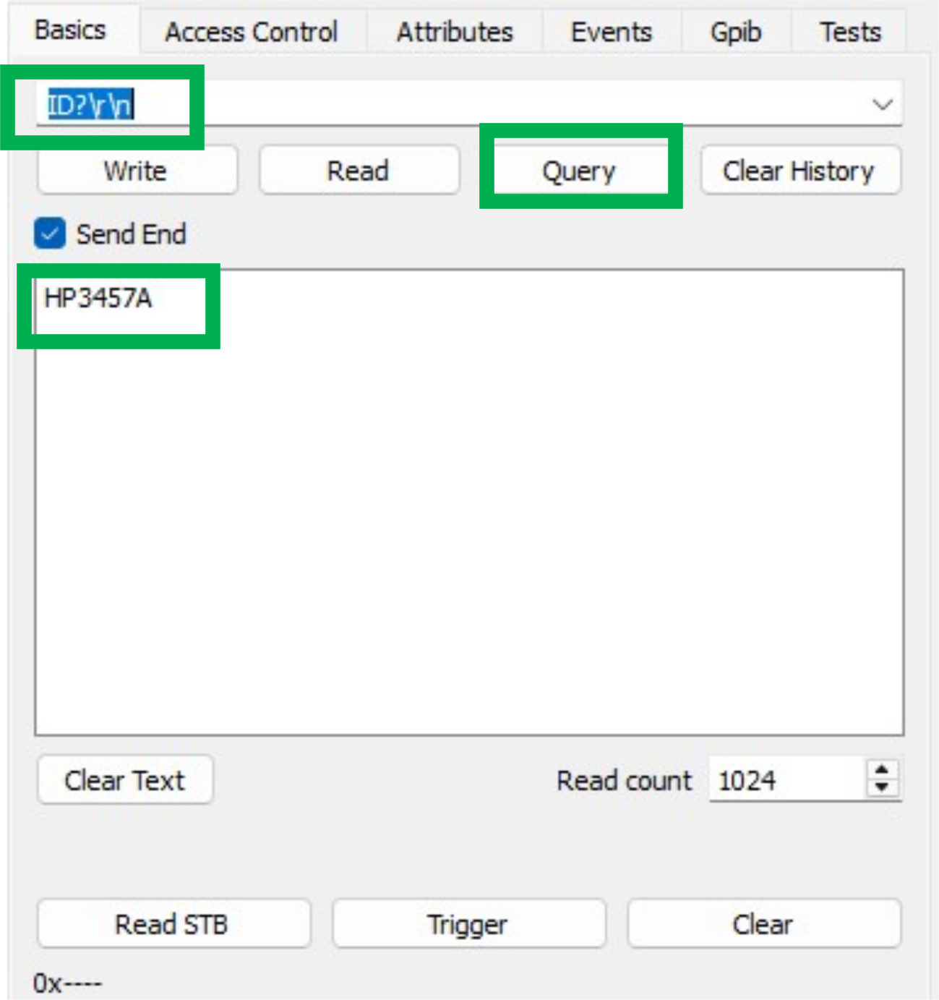

The green highlighted section shows the response and the log window
shows no timeout, but VI_SUCCESS on the read and write instructions.
This confirms that the communication is working.

As mentioned, most equipment does not require an adjustment of the read
termination as they generate an EOI on read to terminate.

Note: Above items show the usage using RSVisaTester in an interactive
way. If you just want to access your instrument using Python, this is
typically not required, but it is a nice tool to debug your instrument.
It can also create logs of your visa instructions which you execute
using Python & PyVisa which is a powerful too for debugging during
development phase.

# Usage with Python

If all above steps succeeded, we can start using the UsbGpib device with
python. The following sections show a step-by-step guide using python
interactively. You can of course also create a script.

## Scanning for connected devices

Start python and import PyVisa.

Import PyVisa:

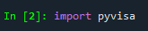

List available measurement devices:

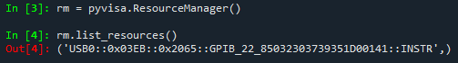

In above output you can see, that one instrument is found. The returned
array contains a single string which is the so called "ressource string"
of the device. As mentioned before, that resource-string will be
different, depending on your actual GPIB device configuration and serial
number of the UsbGpib Adapter.

In case you see multiple devices being returned – the ones containing
texttt0x03EB::0x2065 are the one from the UsbGpib Adapter.

Open the instrument (adjust the string to the one which was returned by
the previous command):

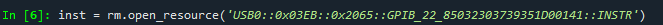

If successful, no error is shown, and we can interact with the
instrument using the "inst" object.

If your instrument is SCPI compliant, you can now simply execute
`instr.query(’*IDN’)` to read the instrument name or better
identification string over GPIB.

As the used HP3457a is not SCPI compliant and requires specific
termination settings, we apply those settings now first during the next
steps.

To set \n termination for that instrument, execute those 2 lines:

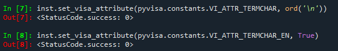

Afterwards the read termination will be set to \n and queries or reads
will be successful from this instrument:

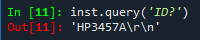

You can now write to the instrument using commands like `inst.write()`
for ASCII strings, `inst_write_binary_values` to send raw binary data,
among other variants.

To read data use inst.read() for ASCII strings,
`inst.read_binary_values()`, etc.

The previously used inst.query command is just a combination of write
followed by read. It will write the provided text strings (here ‘ID?’)
to the instrument, followed by a read and returns the information.

To disconnect from the instrument, execute `inst.close()`.

## Some more pyvisa Hints

### Stripping of read termination

An instrument which returns read termination, like the one used here
will contain in reads always read termination. As visible in previous
example, the ID? Query answer is terminated with \r\n.

Pyvisa can "strip away" the \r\n termination automatically, if you
specify a read_termination to it:

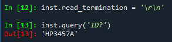

This read_termination setting is just a string handling within PyVisa,
it does not set any read termination of the GPIB adapter itself. So it
is no substitution of the previous `TERMCHAR` and `TERMCHAR_EN`
attributes which were used before.

### Automatic write Termination addition

As you saw in the examples, the query command string included \r\n as
termination. PyVisa can add this automatically, if you specify a write
termination, making the code a bit easier to read.

Again, `write_termination` is just a string based handling. Before the
string gets sent to the device, the set `write_termination` string is
added to the message internally.

### Timeout handling

Some instruments can take a longer time to return a response. This can
e.g. happen for large data transfers. There are sophisticated ways using
service requests that an instrument can signal with interrupts its
readiness, but sometimes it is easier to just increase the timeout.

The property timeout will return the current timeout in units of
milliseconds.

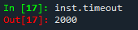

2000 means 2000ms which is 2s. This is the default timeout value.

You can change it by assigning another number to it. To increase the
timeout to 5s, execute:

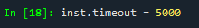

Don’t forget: Timeouts can indicate actual errors like an unsupported
command; It can also indicate wrong write or read termination but also
be just simply the instrument taking a longer time to process a command.
