- [XyphroLabs UsbGpib V2 Linux + Visa
  Guide](#xyphrolabs-usbgpib-v2-linux-visa-guide)
- [Introduction](#introduction)
- [Introduction](#introduction-1)
- [SW setup](#sw-setup)
  - [Installation of R&S Visa](#installation-of-rs-visa)
  - [Installation of PyVisa](#installation-of-pyvisa)
- [HW setup](#hw-setup)
- [First interaction with the
  instrument](#first-interaction-with-the-instrument)
  - [Confirming that the USB device is
    detected](#confirming-that-the-usb-device-is-detected)
  - [Testing if the instrument is detected by R&S
    Visa](#testing-if-the-instrument-is-detected-by-rs-visa)
    - [Why are no USBTMC devices
      found?](#why-are-no-usbtmc-devices-found)
- [Usage with Python & PyVisa](#usage-with-python-pyvisa)
  - [Scanning for connected devices](#scanning-for-connected-devices)
  - [Some more PyVisa hints](#some-more-pyvisa-hints)
    - [Stripping of read termination](#stripping-of-read-termination)
    - [Automatic write Termination
      addition](#automatic-write-termination-addition)
    - [Timeout handling](#timeout-handling)

# XyphroLabs UsbGpib V2 Linux + Visa Guide

Last Update: 2nd February 2026 This document is part of [Xyphro
UsbGpib](https://github.com/xyphro/UsbGpib) project

Prefer PDF? Click here:

# Introduction

# Introduction

This document provides guidance on utilizing the UsbGpib adapter with
Linux, specifically in conjunction with Python.

While the UsbGpib Adapter is no different to other UsbTmc instruments,
because it exposes a standard UsbTmc interface, these instructions are
mainly intended for first time users of Instrument control to give a
kick-start in using it and setting it up.

Various approaches are available, as the USB GPIB Adapter operates via
USBTMC. Users may directly employ the USBTMC Linux driver and interface
through C or other programming languages, use pyvisa-py or pyvisa-usbtmc
(which leverage a more direct access to the USB devices), or adopt the
standard practice of engaging a Visa provider.

The installation process detailed herein uses R&S Visa, which is
controlled from Python using Pyvisa. R&S Visa offers a standardized
interface compatible with PyVisa, LabVIEW, and other software packages.
Visa providers are also available from other companies like NI or
Keysight, but R&S Visa is the Visa provider which requires the least
amount of hard disk space ( 35MB). Most other visa providers install
Gigabytes of files on your computer, which is not required nor helpful.

The primary objective of such a Visa is to deliver a unified API for
managing multiple types of interfaces - regardless of their physical
connection (USB, different Ethernet protocols, Serial port) - and it is
widely used as a standard tool used for automating test and measurement
setups.

For demonstration purposes, Ubuntu 24.04.3 LTS serves as the platform in
this guide. A fresh installation was made to create this guide, to
ensure that all dependencies are captured.

# SW setup

## Installation of R&S Visa

Please visit
<https://www.rohde-schwarz.com/us/applications/r-s-visa-application-note_56280-148812.html>

In case this links does not work in future, use a google search for "R&S
Visa Download" to find the most recent correct link.

Download the RS Visa Setup for Ubuntu:

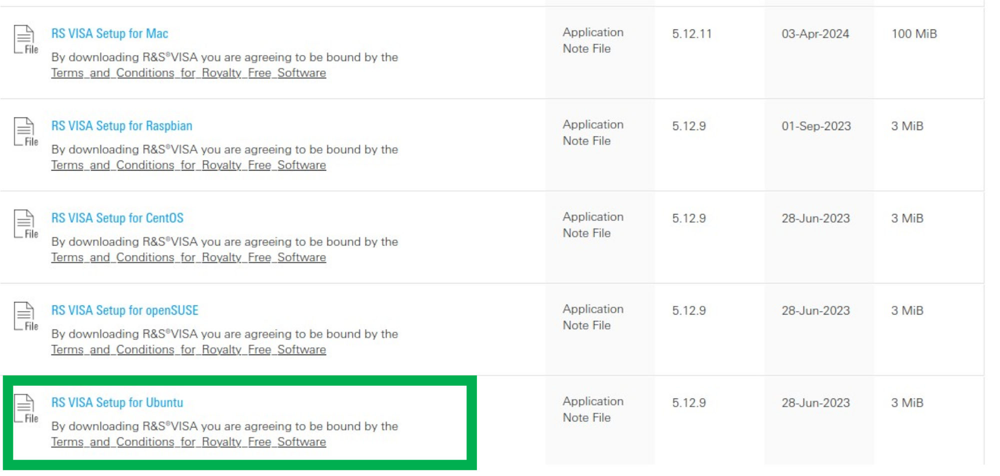

Once downloaded, the file will be in your Downloads folder:

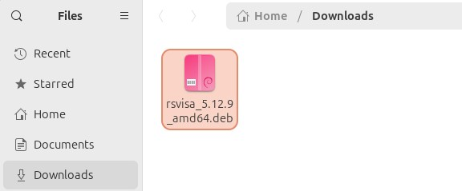

To proceed, double-click the file or install it via the command line.

A warning may appear, indicating that the file originates from a third
party $`R\&S`$:

Select "Install" and confirm your intention to proceed. When prompted,
enter your user password to grant SUDO privileges.

Upon completion of the installation, three new applications will become
available:

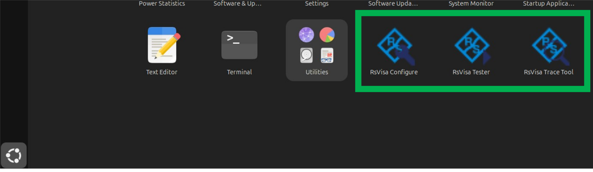

Although not strictly required, RsVisa Tester is a graphical user
interface application that facilitates instrument scanning and enables
basic read/write tests, making it particularly valuable during initial
system bring-up.

Note, that the release notes of R&S Visa contain also installation
instructions – also for Windows, Mac OSX or other Linux flavors; Even
Raspberry PI with Raspbian.

We will continue with the hardware setup in the next section.

## Installation of PyVisa

PyVisa is necessary for interfacing with the instrument using Python.
PyVisa will interface to the visa provider which then interfaces to the
instrument.

This guide utilizes Python 3. Please ensure that both Python 3 and pip3
are installed prior to proceeding.

To ensure that execute from terminal:

    sudo apt-get install python3 python3-pip python3-pyvisa

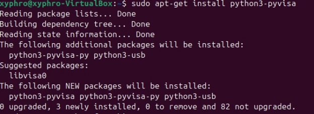 (The actual output
will vary depending on which packages are already installed on your
machine)

All above steps are one-time actions.

Let’s proceed to the HW setup.

# HW setup

In this example I use a HP3457A Multimeter with GPIB:

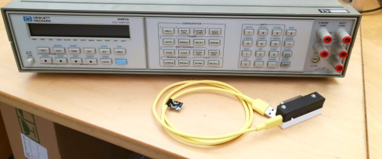

Initial one-time steps:

- Connect it to power but keep it powered off.

- Connect the USB GPIB converter to the GPIB port and the USB cable to
  your PC.  
  Note: The PC won’t detect a USB device yet as the instrument is
  powered off. This is a feature to prevent inaccessible devices are
  showing up on your PC.  
  

- Power on the GPIB device.  
  Note: The PC does now detect a new USB Device.

It is not necessary to follow a specific sequence for connecting or
disconnecting devices, powering them up or down, and similar actions.
However, the following order is provided to present the instructions in
a logical, step-by-step manner. As indicated in the procedure, the
adapter will only be detected by a PC when the instrument is powered on
and GPIB functionality is enabled.

The adapter monitors USB connections to identify whether any devices
with GPIB enabled are present.

Regardless of the specific GPIB address, it systematically scans all
available addresses on its GPIB port. Upon detecting a responsive GPIB
address, the adapter enumerates the device on the USB interface, thereby
enabling access from the PC.

# First interaction with the instrument

## Confirming that the USB device is detected

The following steps are not mandatory but can be beneficial for
debugging. They verify that the USBTMC device is recognized by the PC
and that the instrument is properly powered and configured for GPIB
communication.

Execute from terminal:

    lsusb

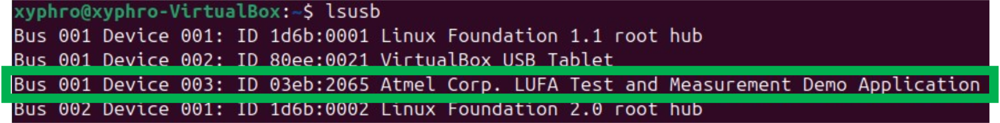

The output above displays an entry with VID:PID 03eb:2065, identifying
the USB GPIB Adapter.

This device will appear when all connections are established according
to the HW-Setup section, GPIB functionality is enabled on the
instrument, and the instrument is powered on.

Further information can be seen when executing:

    lsusb -v

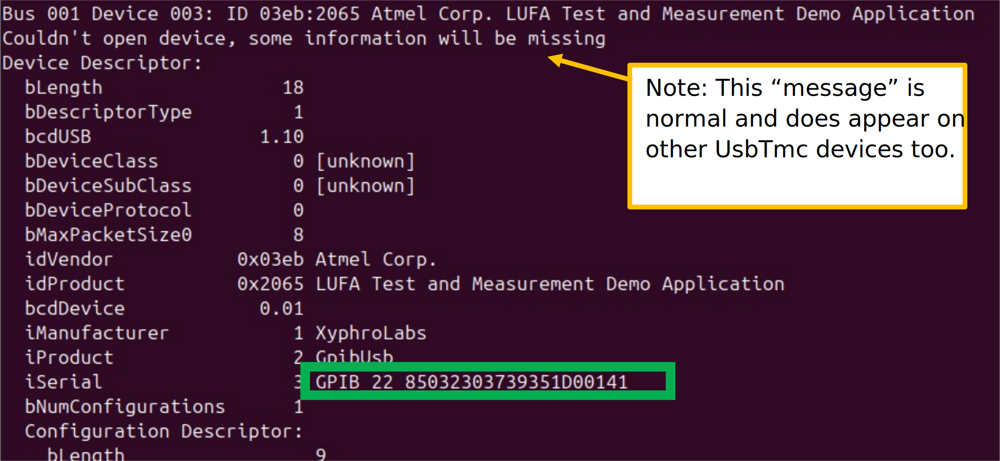

The green highlighted area displays the USBGPIB adapter serial number.
In this instance, it indicates the detected GPIB address, which is 22.
The subsequent numbers represent a unique serial number, allowing users
to distinguish between multiple USB GPIB adapters when identical GPIB
addresses are assigned to different instruments.

Please note that the GPIB adapter may also display the instrument name
instead of the GPIB address if the AutoID feature is enabled.

## Testing if the instrument is detected by R&S Visa

You can close open terminal windows, etc.

Start the RsVisa Tester application:

After starting the below GUI window is shown:  
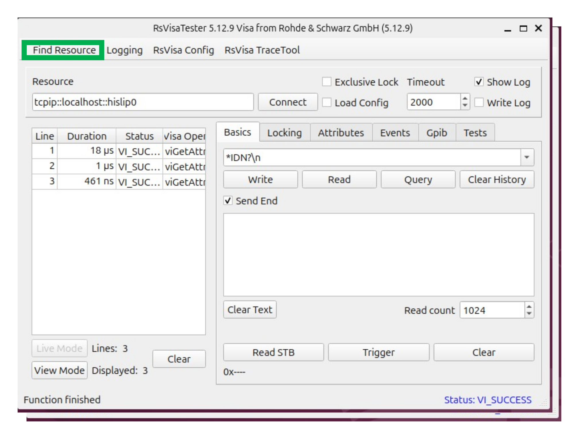

While the interface may appear complex to first-time users, it contains
numerous standard features that help in initial instrument communication
and debug. To verify detection of the GPIB instrument, select “Find
Resource” in the upper left corner.

A new window opens:  

Select the green-highlighted button to initiate an instrument scan.

If no USBTMC devices are detected, please refer to the section titled
"Why are no USBTMC devices found?".

This situation typically occurs during initial installations, and the
section provides guidance on how to enable device availability on a
persistent basis.

If the operation is successful, a USB device should be visible as shown.
Please note that the previously displayed serial number forms part of
the resource string.

Select the found devices and click OK.

Now you are back to the main window. The ressource field should show the
previously detected device:  
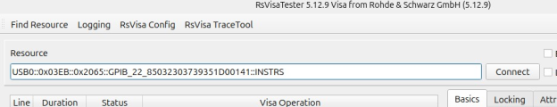

Now you can click on the connect button to connect to the instrument.

The log lines should show a successful connection:  
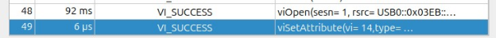

The right side of the main GUI window now gives the ability to interact
with the instrument:  

If your instrument supports the \*IDN? query, you may enter “\*IDN?” in
the designated field and click Query; the instrument’s response will
then be displayed.

However, many legacy instruments do not support this command and may
also lack EOI termination during read operations, which can lead to
unsatisfactory timeout errors giving the impression that communication
is not possible

For this reason, I have prepared this manual for the older HP3457A,
which requires some additional configuration steps. These requirements
are not unique to this USB GPIB Adapter - they apply to any GPIB adapter
and are dictated by the instrument itself.

The equipment’s GPIB programming manuals offer detailed guidance on
configuring the appropriate settings, and additional support is
available in the troubleshooting section if necessary. For certain
legacy instruments, these settings may be challenging to locate and may
require some degree of experimentation.

<u>**Point \#1:**</u> The used HP3457A does default wise not terminate
with EOI, but with \n. A query will result in a timeout.

To enable \n termination, go to the Attributes tab, select
`VI_ATTR_TERMCHAR_EN`, enter 1 in New AttributeValue field and click on
SetAttribute.

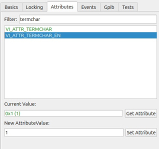

This is a non permanent (so non volatile) setting, which is only valid
for this currently active session.

The attribute `VI_ATTR_TERMCHAR` does select the actual termination
character which is used to detect a termination of read GPIB messages.
Default wise it is 0xa (10), which matches \n and is for most older HP
instruments the correct settings.

<u>**Point \#2:**</u> HP3457A does not support the \*IDN? SCPI standard
query. Older HP Equipment required `"ID?\r\n"` as query.

After adjusting the termination settings as stated in Point \#1 you can
try to execute the ID?\r\n query:

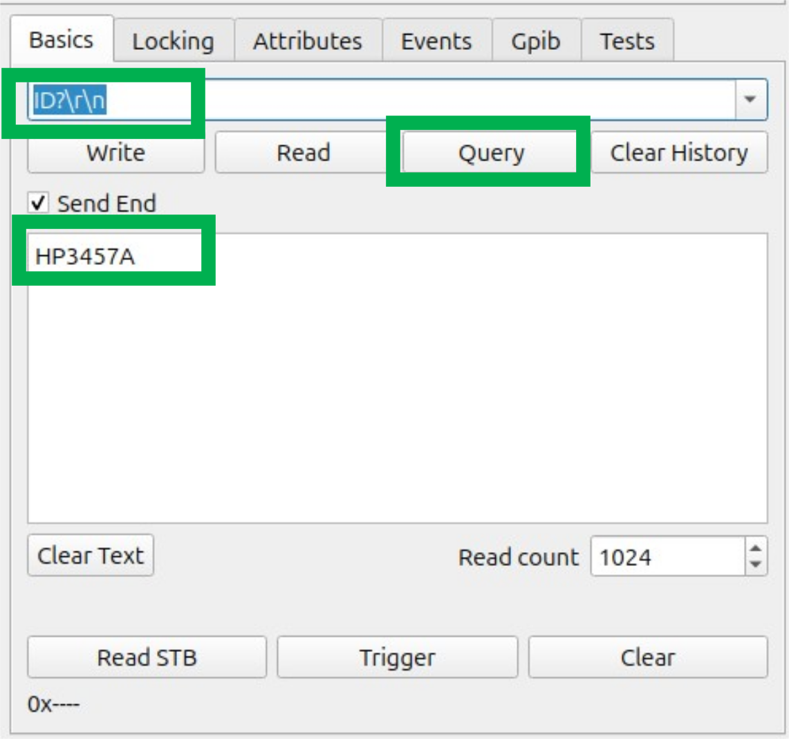

The green highlighted section shows the response and the log window
shows no timeout, but `VI_SUCCESS` on the read and write instructions.
This confirms that the communication is working.

As mentioned, most equipment does not require an adjustment of the read
termination as they generate an EOI on read to terminate.

Note: Above items show the usage using RSVisaTester in an interactive
way. If you just want to access your instrument using Python, this is
typically not required, but it is a nice tool to debug your instrument.
It can also create logs of your visa instructions which you execute
using Python & PyVisa which is a powerful too for debugging during
development phase.

### Why are no USBTMC devices found?

A "Find Resource scan" performed on RsVisaTester may yield no detected
instruments. Furthermore, each time the scan button is pressed, the main
GUI screen’s log displays entries indicating this outcome:

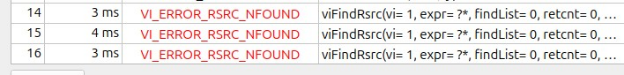

This message indicates that no instruments were detected. However, this
situation may occur even when an instrument is properly connected, but
permissions to usbtmc devices are not properly set up yet on the machine
and access would only work with SUDO rights.

To set them correctly, add them to the usbtmc.rules file:

Execute:

    sudo nano /etc/udev/rules.d/99-usbtmc.rules

Add this line to the file:

    SUBSYSTEM=="usb", ATTR{idVendor}=="03eb", ATTR{idProduct}=="2065", MODE="0666"

The 2 highlighted parts are the vendor ID and product ID, which were
shown earlier in the lsusb output. For this USB GPIB adapter, the
numbers will never change and always be the same. But in case you want
to support other USB connected measurement instruments, adjust those
numbers.

After adding this line and saving with \<CTRL\>+O and exciting, execute:

    sudo udevadm control --reload-rules
    sudo udevadm trigger

or reboot the machine.

Also disconnect and reconnect the USB cable once after executing those
lines.

Note: Instead of using the described line, you can also add this line:

    KERNEL=="usbtmc[0..9]", SUBSYSTEM=="usbmisc", MODE="0666"

It will set usbtmc0 to usbtmc9 devices access rights, without requiring
to specify a vendor and product ID, thus is a bit more generic.

# Usage with Python & PyVisa

If Python and PyVISA have been installed as outlined in previous
sections, you should now be able to communicate with your instrument.
This section provides suggestions and example code snippets to assist
with this process.

While step-by-step interactive usage within the Python console is
demonstrated here, the provided snippets may also be integrated into
standalone Python scripts as needed.

## Scanning for connected devices

Start python3:  

Import pyvisa:  

And create a visa resource manager (which allows listing resources at a
later stage):  
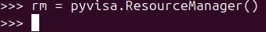

When you enter: `rm.list_ressources()` all available visa resources will
be shown:  
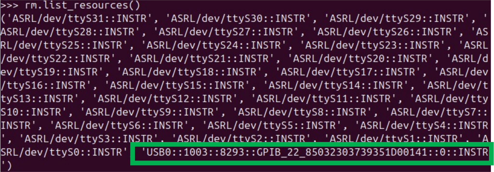

Our instrument is also part of this, as highlighted with the green box.

To open the instrument, type:  

Your actual instrument name (called the resource string) will vary of
course.

In case a "\[Errno 16\] Resource busy" error is shown, it is possible,
that it is e.g. still open in RsVisaTester – ensure that you are
disconnect there. It is also possible, that the device is still open
from previous python experiments – in that case execute inst.close()
before or create a new python session.

If successful, no error is shown, and we can interact with the
instrument using the "inst" object.

If your instrument is SCPI compliant, you can now simply execute
instr.query(’\*IDN’) to read the instrument name or better
identification string over GPIB.

As the used HP3457a is not SCPI compliant and requires specific
termination settings, we apply those settings now first during the next
steps.

To set \n termination for that instrument, execute those 2 lines:  
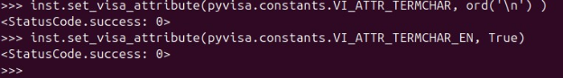

Afterwards the read termination will be set to \n and queries or reads
will be successful from this instrument:  

You can now write to the instrument using commands like `inst.write()`
for ascii strings, textttinst_write_binary_values to send raw binary
data, among other variants.

To read data use `inst.read()` for ascii strings,
`inst.read_binary_values()`, etc.

The previously used `inst.query` command is just a combination of write
followed by read. It will write the provided text strings (here `’ID?’`)
to the instrument, followed by a read and returns the information.

To disconnect from the instrument, execute `inst.close()`.

## Some more PyVisa hints

### Stripping of read termination

An instrument which returns read termination, like the one used here
will contain in reads always read termination. As visible in previous
example, the `ID?` Query answer is terminated with \r\n.

Pyvisa can "strip away" the \r\n termination automatically, if you
specify a read_termination to it:  
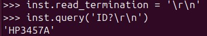

This read_termination setting is just a string handling within pyvisa,
it does not set any read termination of the GPIB adapter itself. So it
is no substitution of the previous `TERMCHAR`and `TERMCHAR_EN`
attributes which were used before.

### Automatic write Termination addition

As you saw in the examples, the query command string included \r\n as
termination. PyVisa can add this automatically, if you specify a write
termination, making the code a bit easier to read.  

Again, write_termination is just a string based handling. Before the
string gets sent to the device, the set write_termination string is
added to the message internally.

### Timeout handling

Some instruments can take a longer time to return a response. This can
e.g. happen for large data transfers. There are sophisticated ways using
service requests that an instrument can signal with interrupts it’s
readiness, but sometimes it is easier to just increase the timeout. The
property timeout will return the current timeout in units of
milliseconds.  
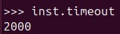

2000 means 2000ms which is 2s. This is the default timeout value. You
can change it by assigning another number to it. To increase the timeout
to 5s, execute:  

Don’t forget: Timeouts can indicate actual errors like an unsupported
command; It can also indicate wrong write or read termination but also
be just simply the instrument taking a longer time to process a command.
